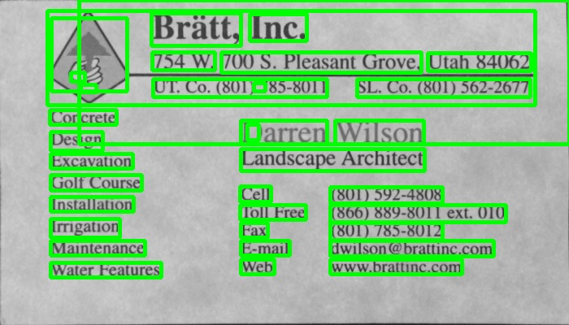

# NOSTRADAMOVIES (Film Prediction)
Bienvenue dans ce projet réalisé dans le cadre de ma formation à Epitech ! Notre objectif est de développer une IA capable de prédire le genre d'un film à partir de son affiche.
Voici les concepts utilisés pour mener à bien ce projet :

## Paragraphe 1 : OCR (Reconnaissance Optique de Caractères)
Nous avons mis en place un système sophistiqué de reconnaissance optique de caractères (OCR). Cette technologie nous permet d'extraire avec précision les informations textuelles cruciales telles que le titre du film, les noms des acteurs et des réalisateurs à partir des affiches de films.

## Paragraphe 2 : Face detection (Détection de Visages)
Dans cette partie de notre projet, nous avons intégré une fonctionnalité de détection faciale avancée. Pour parvenir à identifier les visages des acteurs sur l'affiche, nous nous appuyons sur une base de données de visages connus. Cette base de données contient des informations sur les visages d'acteurs populaires, ce qui nous permet de comparer les visages détectés sur l'affiche avec ceux de la base de données. En reconnaissant les visages des acteurs, nous pouvons ensuite déduire le genre du film en nous basant sur le genre des acteurs impliqués. Par exemple, si les visages reconnus appartiennent principalement à des acteurs connus pour jouer dans des films d'action, il est probable que le film soit également un film d'action. Cette approche nous permet d'exploiter les données sur les acteurs pour prédire le genre du film avec précision.

## Paragraphe 3 : Colorimétrie
La colorimétrie joue un rôle crucial dans notre approche. Dans ce troisième paragraphe, nous examinons les schémas de couleurs utilisés dans l'affiche pour en déduire des informations sur le genre du film. Par exemple, les affiches de films d'horreur peuvent avoir des palettes de couleurs sombres et contrastées, tandis que les comédies peuvent utiliser des couleurs vives et des tons plus légers.

## Paragraphe 4 : Analyse de Texte
Enfin, dans le quatrième paragraphe, nous utilisons une analyse textuelle pour interpréter les éléments textuels restants sur l'affiche. Cela nous permet de détecter des mots-clés ou des phrases qui peuvent être associés à des genres spécifiques de films, tels que "action", "romance" ou "science-fiction".

Ce projet combine de manière innovante différentes techniques d'intelligence artificielle pour fournir des prédictions de genre de films précises et fiables à partir de leurs affiches.

